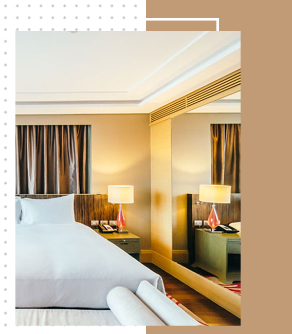

# 🏨 Hotel Sharan

Projeto completo de site para um hotel, com **front-end**, **painel administrativo** e **integração com banco de dados MySQL**.  
Desenvolvido em **HTML, CSS, JavaScript e PHP**, utilizando o **XAMPP** como ambiente local de execução.

---

## 📁 Estrutura do Projeto

```
projeto.essentia/
├── admin/                # Painel administrativo
│   ├── admin_dashboard.php
│   ├── rooms_crud.php
│   ├── reservations_crud.php
│   └── layout_admin.php
│
├── backend/              # Conexões e scripts do servidor
│   ├── conexao.php
│   ├── hotel_schema.sql
│   ├── newsletter_submit.php
│   └── reserva_submit.php
│
├── front-end/            # Parte pública do site (usuário final)
│   ├── front/
│   │   ├── home-inicio.html
│   │   ├── reserva.html
│   │   └── js/
│   │       ├── script.js
│   │       └── reserva.js
│   └── css/
│       └── styles.css
│
├── img/                  # Imagens do site
├── icones/               # Ícones decorativos
└── README.md
```

---

## ⚙️ Requisitos

- [XAMPP](https://www.apachefriends.org/pt_br/index.html) (ou outro servidor local com PHP e MySQL)
- Navegador atualizado (Chrome, Edge, Firefox, etc.)

---

## 🚀 Como Rodar o Projeto

### 🔹 1. Instalar e abrir o XAMPP
1. Execute o **XAMPP Control Panel**.  
2. Inicie os módulos **Apache** e **MySQL**.

---

### 🔹 2. Configurar o projeto
1. Copie a pasta `projeto.essentia` para dentro da pasta:
   ```
   C:\xampp\htdocs\
   ```
2. O caminho final deve ficar assim:
   ```
   C:\xampp\htdocs\projeto.essentia\
   ```

---

### 🔹 3. Importar o banco de dados
1. Abra [phpMyAdmin](http://localhost/phpmyadmin).  
2. Crie um novo banco chamado:
   ```
   hotel_sharan
   ```
3. Clique em **Importar** e selecione o arquivo:
   ```
   backend/hotel_schema.sql
   ```
4. Clique em **Executar**.

---

### 🔹 4. Acessar o site
No navegador, digite:

- **Página principal (usuário):**  
  👉 [http://localhost/projeto.essentia/front-end/front/home-inicio.html](http://localhost/projeto.essentia/front-end/front/home-inicio.html)

- **Painel administrativo:**  
  👉 [http://localhost/projeto.essentia/admin/admin_login.php](http://localhost/projeto.essentia/admin/admin_login.php)

---

## 💻 Funcionalidades

- Formulário de reserva de quartos com envio ao banco de dados  
- Painel administrativo para gerenciar:
  - Quartos
  - Reservas
  - Assinantes da newsletter  
- Integração com banco MySQL  
- Layout responsivo e moderno  

---

## 🧠 Tecnologias Utilizadas

- **HTML5 / CSS3 / JavaScript**
- **PHP 8+**
- **MySQL**
- **Bootstrap 5**
- **Google Fonts (DM Serif Text, Roboto)**

---

## 📸 Capturas de Tela

### 🏠 Página Inicial


### ⚙️ Painel Administrativo


---

## 📜 Licença
Este projeto é de uso pessoal e educacional.  
Desenvolvido por **Oswaldo Braga Góes Junior** 💻
